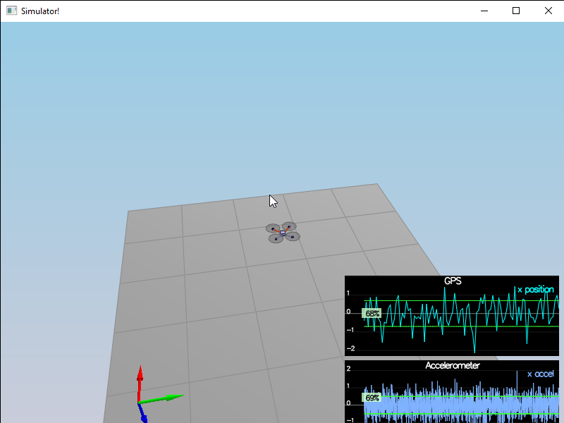

# Step 1: Sensor Noise
By calculating standard deviations from the log files, I find that GPS X data follow `N(0, 0.7)` and accelerometer X data follow `N(0, 0.5)`.
Thus I set `MeasuredStdDev_GPSPosXY = 0.7` and `MeasuredStdDev_AccelXY = 0.5`. Following is the simulation result:

# Step 2: Attitude Estimation
By converting roll, pitch and yaw into quaternion and integrate body rate into the quaternion and then convert back, the nonlinear complementary filter is implemented as described in the document. Simulation result:

# Step 3: Prediction Step
The extended Kalman filter prediction function `Predict()` depends on both the transition function `PredictState()` and its Jacobian matrix which further depends on the `GetRbgPrime()` matrix. After implementing the matrices and state / covariance updates, I tune the `QPosXYStd` and the `QVelXYStd` to give following result:

# Step 4: Magnetometer Update
Since magnetometer measure is quite simple, its corresponding measurement matrix and derivative are also quite simple. I just plug the `hPrime` and `zFromX` values directly and get the following result with `QYawStd = 0.1`:

